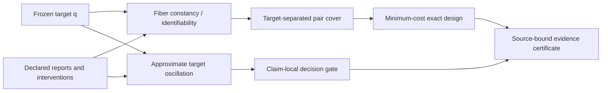

# BSC Core v1.5

## Identifiability, causal transfer, and auditable evidence

**Status:** post-v1.4.0 research milestone; not a versioned release

**Mathematical scope:** finite readiness systems and operational
identifiability, with carefully separated proposed extensions

**Evidence scope:** human-readable proofs, a bounded Lean-checked theorem slice, two exact
finite fixtures, a machine-readable selected-claim package, and internal
adversarial review

**Novelty status:** unknown; no priority claim is made

[Read the two-minute executive summary](synopsis/BSC_Core_v1_5_Executive_Summary.md)
or inspect the [internal adversarial validation report](research/BSC_Core_v1_5_Validation_Report.md).

## Executive result

BSC now has a compact mathematical center:

> A claim transfers through a declared report exactly when the target is
> constant on every report fiber. In a finite model, selecting a least-cost
> family of reports that makes this true is a target-relative weighted
> set-cover problem.

That statement turns the framework from a system that can only say “the
evidence is insufficient” into one that can answer a bounded operational
question: **which additional declared observations would remove the remaining
target ambiguity, at what declared cost?**

The milestone also repairs readiness semantics. Verdict, run outcome, and
evidence readiness are different types. Readiness is a product of applicable
coordinates; an inapplicable coordinate is absent, not an artificial highest
or lowest value. Monotone dependency caps may contain cycles, and their finite
synchronous closure has a greatest compatible fixed point below the initial
assignment.

## The architecture



This flow is target-relative. An experiment may identify one query and fail to
identify another. A low-cost design is optimal only for its frozen candidate
space, reports, costs, target, and tolerance convention.

## Acceptance boundary

The requested ten-part milestone is represented as follows.

| Requirement | Public artifact | Status and ceiling |
|---|---|---|
| Product readiness order | [Foundations §§1–2](framework/BSC_Core_v1_5_Foundations.md) and [Lean readiness module](formal/bsc_core/BscCore/Readiness.lean) | Mathematical semantics; no scalar ranking and no ordering of verdict polarity |
| Cyclic readiness theorem | [Foundations §2](framework/BSC_Core_v1_5_Foundations.md), [cap-system module](formal/bsc_core/BscCore/CapSystem.lean), and [F15](fixtures/F15_cyclic_readiness/README.md) | Compatibility closure; not evidence grounding and not independence |
| Identifiability/factorization | [Foundations §3](framework/BSC_Core_v1_5_Foundations.md) and [Lean identifiability module](formal/bsc_core/BscCore/Identifiability.lean) | Set-theoretic theorem on attainable reports; no model-validity claim |
| Finite weighted design | [Foundations §4](framework/BSC_Core_v1_5_Foundations.md), [exact checker](tools/bsc_intervention_design.py), and [F14](fixtures/F14_intervention_identifiability/README.md) | Exact bounded finite enumeration; no general complexity improvement |
| Causal-transfer profile | [Causal profile](framework/Causal_Transfer_Profile.md) | Proposed normative certificate profile; not a causal theorem or experiment |
| AI-assisted evidence profile | [AI evidence profile](framework/AI_Assisted_Research_Evidence_Profile.md) | Proposed governance profile; agent agreement is not independent proof |
| Machine-readable claim graph | [Registry](ledgers/BSC_Core_v1_5_Claim_Registry.json), [readiness graph](ledgers/BSC_Core_v1_5_Claim_Graph.json), [registry schema](schemas/bsc-core-v1.5-claim-registry.schema.json), [graph schema](schemas/bsc-claim-readiness-graph-v1.schema.json), and [retained package receipt](ledgers/BSC_Core_v1_5_Claim_Package.receipt.json) | Selected milestone claims, dependencies, readiness caps, sources, evidence, and ceilings; schemas are structural only |
| First non-Q26 BSC Lean slice | [`formal/bsc_core`](formal/bsc_core/README.md) | Pinned Lean/mathlib project; exact theorem and axiom boundary in its README |
| Prior-art equivalence matrix | [Matrix](research/BSC_Core_v1_5_Prior_Art_Equivalence_Matrix.md) | Bounded primary-source comparison; novelty remains unknown |
| Stop breadth expansion | This hub and the [roadmap](ROADMAP.md) | No new application chapter is part of this milestone |

## Mathematical center

### 1. Readiness is not a verdict

For a claim with applicable coordinate set $A(c)$, readiness lies in the
product of only those coordinate orders. The product meet cannot turn a false
claim true, convert a failed run into success, or make an inapplicable axis
look excellent. Verdict and execution outcome travel beside readiness rather
than inside it.

The concrete graph uses cumulative level labels such as
`kernel-check-added` and `internal-adversarial-complete`. They mean that the
named gate has been added to the lower gates; they do not pretend that an
arbitrary external review dominates every internal review.

### 2. Cyclic dependencies close by compatibility

For initial readiness $r^0$ and monotone edge caps, the simultaneous update is

```math
F(r)_v
=
r_v^0\wedge
\bigwedge_{u\to v}\kappa_{uv}(r_u).
```

The finite descending iteration from $r^0$ terminates at the greatest
compatible fixed point. This result answers a policy question—what readiness
survives every declared cap? It does **not** prove that circular sources are
true, independent, or non-collusive.

The foundations prove this for finite vertex-specific readiness lattices.
The Lean slice deliberately checks a narrower homogeneous common-lattice
specialization and records it separately as `BSC-RDY-03`; it does not borrow
kernel authority for the broader `BSC-RDY-02` statement.

### 3. Identifiability is factorization on attainable reports

Let $X$ be the declared candidates, $q:X\to Z$ the target, and
$\rho_J:X\to\prod_{i\in J}Y_i$ the joint report. Then the following agree:

1. equal joint reports imply equal target values;
2. the report equivalence relation refines the target equivalence relation;
3. the target factors through the attainable joint reports.

The codomain qualification matters. The decoder is required only on reports
that some declared candidate can actually produce.

### 4. Finite experiment selection is target-relative cover

For finite $X$, each intervention covers the candidate pairs it distinguishes.
The required universe contains only pairs on which the target differs. A
family identifies $q$ exactly when its covered-pair union contains that
universe. Nonnegative declared costs therefore give a finite weighted
set-cover instance.

This is an established combinatorial form. BSC's present contribution is the
claim-relative, typed, source-bound integration—not invention of set cover or
Test Cover.

### 5. Approximate ambiguity is retained, not rounded away

The target oscillation is the largest target discrepancy among pairs that
remain indistinguishable within every selected report tolerance. Adding
constraints or tightening tolerances shrinks that compatible-pair set.
Decision promotion still requires a separate, strict, claim-local margin
argument; equality at the boundary is not headroom.

## Exact finite evidence

### F14 — intervention identifiability

F14 contains four candidate states, three reports, rational costs, finite
metrics, and rational tolerances. Exact enumeration finds minimum cost `2` and
retains both minimizers:

- `direct`; and
- `column` plus `row`.

The deterministic reporting rule selects `direct` because it uses fewer
reports, without deleting the tie. Under the declared tolerance, `direct` is
exactly injective but has target oscillation `3/2`; exact and robust
identifiability are therefore visibly different claims.

### F15 — cyclic readiness

F15 contains a three-node cycle with per-axis applicability. Its retained
closure is cross-checked by exhaustive enumeration: 84 assignments satisfy
the declared initial ceilings and edge caps, and the retained assignment is
componentwise greatest. Mathematical verdicts are carried unchanged.

The cross-check shares parsing and model definitions with the primary tool;
unless a fully separate implementation is supplied, it is not labeled an
independent implementation.

## Machine-readable evidence package

The selected-claim package has two layers:

1. the registry freezes readable statements, verdicts, dependencies, sources,
   evidence paths, and authority ceilings; and
2. the readiness graph gives applicable cumulative axes, initial curator
   assessments, and executable dependency caps.

The package checker requires exact registry/graph ID agreement, exact
verdict agreement, dependency-edge equality, safe repository-relative paths,
and current SHA-256 values for every referenced artifact.
Its package-level artifact set also binds the formal root, examples, tests,
README, three dependency pins, both structural schemas, public CI workflow,
and integration regression rather than relying on one theorem-file hash.

The two JSON Schemas document the closed wire shapes. They are structural
aids, not semantic validators; the Python package checker supplies the
cross-reference, dependency, cap-evaluation, path, and byte-identity checks.

An evaluator `PASS` proves that those bytes and relationships satisfy the
checker. Initial verdicts and readiness levels are curator-supplied premises;
cap propagation cannot prove their truth.

## Formal trust boundary

The first non-Q26 BSC Lean project is an intentionally bounded theorem slice. It formalizes the
product/readiness slice, a cyclic-cap fixed-point slice, attainable-report
factorization, finite pair separation, and finite oscillation monotonicity.
The project is pinned to stable Lean 4.33.0 and matching mathlib.

Lean acceptance means that the encoded declarations follow from the reported
trust base. It does not establish:

- that the encoded statement is the intended prose without semantic review;
- that a physical model is true;
- that the result is novel; or
- that the complete eight-field BSC transfer record forms a category.

The exact statement map, build commands, prohibited-construct scan, and axiom
audit are in the [formal README](formal/bsc_core/README.md).

## Causal and AI profiles

The causal profile separates observational, interventional, and
counterfactual authority. Its deficiency quantity is ordinary statistical
deficiency on an intervention-expanded parameter family, with one uniform
garbling kernel. The name `do` does not itself establish causal semantics.

The AI-assisted profile freezes the target before evaluation, distinguishes
candidate generation from verification, classifies checker independence, and
preserves material failures. Multiple agents from one provider or shared code
base are correlated search lanes, not outside referees.

## Prior art and recent science

The [equivalence matrix](research/BSC_Core_v1_5_Prior_Art_Equivalence_Matrix.md)
records direct antecedents in product orders, monotone fixed points,
identifiability and sufficiency, Le Cam deficiency, Test Cover, causal
abstraction, Markov categories, cospans, optics, assume–guarantee contracts,
and provenance semirings.

The [recent research intake](research/BSC_Core_v1_5_Recent_Research_Intake.md)
separately records current work on autoformalization, explicit physical
postulates, formal causal probability, causal abstraction, quantum reference
frames, inverse measurement design, theorem-proving agents, and scientific
software agents. Those sources changed workflow and future interfaces; they
did not automatically promote existing BSC claims.

## Reproduce

From the repository root with Python 3:

```text
python3 -I -B fixtures/F14_intervention_identifiability/check_fixture.py
python3 -I -B fixtures/F15_cyclic_readiness/check_fixture.py
python3 -I -B tools/bsc_claim_readiness.py check ledgers/BSC_Core_v1_5_Claim_Graph.json ledgers/BSC_Core_v1_5_Claim_Graph.receipt.json
python3 -I -B tools/bsc_core_claim_package.py check ledgers/BSC_Core_v1_5_Claim_Registry.json ledgers/BSC_Core_v1_5_Claim_Package.receipt.json
python3 -I -B -m unittest discover -s tests -p 'test_bsc_*' -v
```

For the Lean slice:

```text
cd formal/bsc_core
lake build
lake env lean BscCore/Tests.lean
lake env lean BscCore/AxiomAudit.lean
```

The repository `make verify` target runs the integrated non-release checks.

## What this milestone does not claim

- It is not a rewrite of the immutable v1.4.0 paper, PDFs, fixtures, tag, DOI,
  or archive.
- It does not validate a new physical, causal, quantum, inverse, or empirical
  model.
- It does not establish a full category, double category, sheaf, stack, or
  provenance algebra for BSC.
- It does not establish universal novelty or priority.
- It does not turn AI agreement into independent review.
- It does not promote a claim merely because its files have matching hashes.

## Next research gate

The breadth stop remains active. The next foundational step is not another
application crosswalk. It is one of:

1. an external mathematical review of the integrated core and equivalence
   matrix;
2. a formally checked finite operational channel/total-variation kernel;
3. a definition-by-definition comparison with contemporary causal
   abstraction and minimal experiment-design work; or
4. the actual displayed/double-category construction with its laws proved.

Until one of those closes, BSC should describe itself as a **typed
evidence-transfer contract with a formalized finite core**, not as a newly
established category or universally validated scientific theory.
